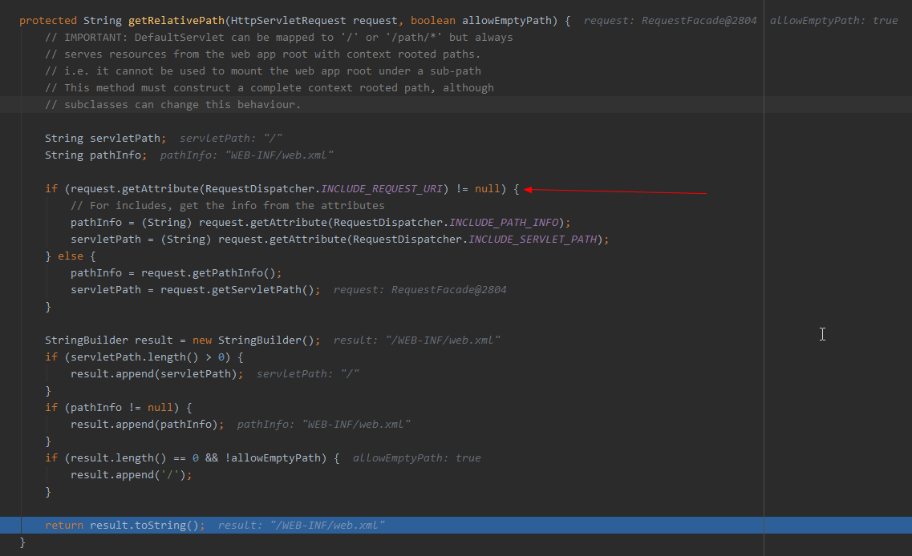
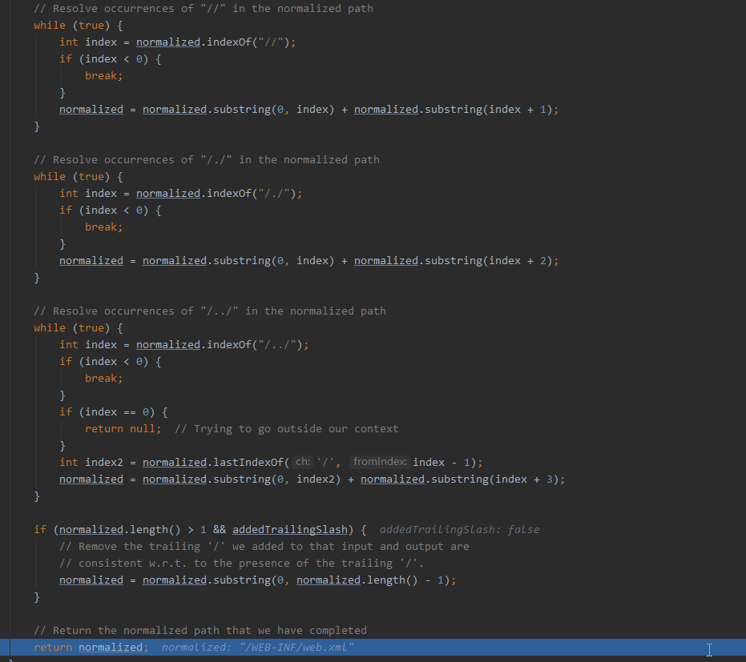

### 0x00 简述

漏洞名称：Tomcat ajp协议导致任意文件读取

漏洞编号：CVE-2020-1938

漏洞影响：发送恶意数据包进行文件读取或命令执行

影响平台：ALL

影响版本：Tomcat 6.\* ;    

​					Tomcat 7.\* < 7.0.100;   

​					Tomcat 8.\* < 8.5.51;

​					Tomcat 9.\* < 9.0.31

### 0x01 漏洞分析

#### 环境搭建

到[镜像网站](https://mirrors.huaweicloud.com/apache/tomcat/tomcat-8/v8.5.49/ )下载漏洞版本的 bin 和 src，这里选择的8.5.49，下载之后用idea打开src，并新增一个pom.xml在项目根目录，内容如下：

```xml
<?xml version="1.0" encoding="UTF-8"?>

<project xmlns="http://maven.apache.org/POM/4.0.0"
         xmlns:xsi="http://www.w3.org/2001/XMLSchema-instance"
         xsi:schemaLocation="http://maven.apache.org/POM/4.0.0 http://maven.apache.org/xsd/maven-4.0.0.xsd">

    <modelVersion>4.0.0</modelVersion>
    <groupId>org.apache.tomcat</groupId>
    <artifactId>Tomcat8.0</artifactId>
    <name>Tomcat8.0</name>
    <version>8.0</version>

    <build>
        <finalName>Tomcat8.0</finalName>
        <sourceDirectory>java</sourceDirectory>
        <testSourceDirectory>test</testSourceDirectory>
        <resources>
            <resource>
                <directory>java</directory>
            </resource>
        </resources>
        <testResources>
            <testResource>
                <directory>test</directory>
            </testResource>
        </testResources>
        <plugins>
            <plugin>
                <groupId>org.apache.maven.plugins</groupId>
                <artifactId>maven-compiler-plugin</artifactId>
                <version>2.3</version>
                <configuration>
                    <encoding>UTF-8</encoding>
                    <source>1.8</source>
                    <target>1.8</target>
                </configuration>
            </plugin>
        </plugins>
    </build>

    <dependencies>
        <dependency>
            <groupId>junit</groupId>
            <artifactId>junit</artifactId>
            <version>4.12</version>
            <scope>test</scope>
        </dependency>
        <dependency>
            <groupId>org.easymock</groupId>
            <artifactId>easymock</artifactId>
            <version>3.4</version>
        </dependency>
        <dependency>
            <groupId>ant</groupId>
            <artifactId>ant</artifactId>
            <version>1.7.0</version>
        </dependency>
        <dependency>
            <groupId>wsdl4j</groupId>
            <artifactId>wsdl4j</artifactId>
            <version>1.6.2</version>
        </dependency>
        <dependency>
            <groupId>javax.xml</groupId>
            <artifactId>jaxrpc</artifactId>
            <version>1.1</version>
        </dependency>
        <dependency>
            <groupId>org.eclipse.jdt.core.compiler</groupId>
            <artifactId>ecj</artifactId>
            <version>4.5.1</version>
        </dependency>
    </dependencies>
</project>
```

按照下面图示新增Application的配置信息


1、在`Man class`中填入:`org.apache.catalina.startup.Bootstrap`

2、在`VM options`:中填入:`-Dcatalina.home="G:\vuln_environment\tomcat8.5.49\apache-tomcat-8.5.49" -Dfile.encoding=UTF-8`，这里需要将catalina.home替换成你下载的tomcat binary的目录

3、jdk默认是1.8，因为我装的就是jdk1.8版本

4、需要将`TestCookieFilter.java`注释，不然会报错。 

配置完成之后直接运行，出现下面截图就表示环境搭建成功：


#### 基础知识

##### AJP协议

`AJP`即 `Apache JServ Protocol` ，是一个二进制的`TCP`传输协议，默认监听`8009`端口，设计目标是为了更高的性能以及添加`SSL`支持，但是并不支持浏览器的直接访问。因此它的职责是负责和其他的`HTTP`服务器建立连接，在与其他`HTTP`服务器集成时，就可以用到这个协议进行交互，从而加速访问，如下：


实际情况是除了`Apache`之外别的`http server`几乎都不能支持反向代理`AJP13`协议，再加上`Nginx`处理性能比`ajp`快，所以做静态资源处理的时候一般都用`Nginx+Tomcat` ，这种场景下一般都会禁用掉`AJP`协议，所以`AJP`协议实际生产很少见。

##### AJP请求包

搭建环境以后跑了一下`exp`，然后用`wireshark`抓包可以看到整个利用过程就`4`个数据包，`1`个请求`3`个响应。


主要关注第一个请求包，参数包的具体内容：


其中有四个比较重要的参数

```
URI:/asdf
javax.servlet.include.request_uri:/
javax.servlet.include.path_info: WEB-INF/Test.txt
javax.servlet.include.servlet_path:/
```

##### URI与Servlet

我们知道`Tomcat`在运行时如果收到某个`URI`的请求，将查询`mapping table`找到请求`URI`对应的`servlet`，并运行该`servlet`以获得请求回应 。在默认配置下，`Tomcat`有2个`servlet`，分别是`DefaultServlet` 和`JspServlet`，其对应的配置如下：

```xml
    <servlet>
        <servlet-name>default</servlet-name>
        <servlet-class>org.apache.catalina.servlets.DefaultServlet</servlet-class>
        <init-param>
            <param-name>debug</param-name>
            <param-value>0</param-value>
        </init-param>
        <init-param>
            <param-name>listings</param-name>
            <param-value>false</param-value>
        </init-param>
        <load-on-startup>1</load-on-startup>
    </servlet>

    <servlet>
        <servlet-name>jsp</servlet-name>
        <servlet-class>org.apache.jasper.servlet.JspServlet</servlet-class>
        <init-param>
            <param-name>fork</param-name>
            <param-value>false</param-value>
        </init-param>
        <init-param>
            <param-name>xpoweredBy</param-name>
            <param-value>false</param-value>
        </init-param>
        <load-on-startup>3</load-on-startup>
    </servlet>
```

那我们漏洞利用的URI请求应该由哪一个进行处理呢？可以查看配置文件：


可以看到这里凡是 `jsp`与`jspx`后缀的资源都会走`JSPServlet`进行处理，我们这次的漏洞是出在`DefaultServlet`，所以请求的URI后缀不能是 `Jsp` 或者 `Jspx`，所以上面`exp`发送的数据包我们可以看到`URI`为`/asdf`

#### 漏洞调试1.0

根据指引我们定位到 `org.apache.coyote.ajp.AjpProcessor`这个类，根据网上透漏的漏洞消息，我们得知漏洞的产生是由于`Tomcat`对`ajp`传递过来的数据的处理存在问题，导致我们可以控制

```
javax.servlet.include.request_uri
javax.servlet.include.path_info
javax.servlet.include.servlet_path
```

这三个参数，从而读取任意文件，甚至可以进行`RCE`。 我搭建的环境是`8.5.49`，下断点在`org/apache/coyote/ajp/AjpProcessor`的`prepareRequest`方法中`request.setAttribute(n, v );`处并运行exp


跟进这个函数方法发现是赋值操作：


经过3次循环赋值之后将上面提到的3个参数和值存到了一个 `HashMap` 中：


到这里就是漏洞的前半部分，即传输变量并将其改造为我们想要的数据。可以看到此时函数调用栈的顺序如下：


由于传输使用的是`AJP`协议，所以是通过`SocketPeocessore`这个内部类来进行处理，经过几次处理之后传到了我们下断点的`AjpProcessor`处。 

#### 漏洞调试2.0

根据前面的基础知识我们知道这里需要到`DefaultServlet`进行处理，接下来我们找到`DefaultServlet Class`，下断点到`doGet()`方法：


`doGet()`方法又会调用`serveResource()`，步入看一下：


 `serveResource()`又调用了 `getRelativePath()` ，注释的说明是`Identify the requested resource path`，步入，看头所指的if语句，这里判断 `request_uri` 不为空才会接收我们传入的`path_info` 和 `servlet_path` ，因此前面我们看到的数据包里面 `request_uri` 为 `/` ，否则进入到下面的 ` else ` 就会导致漏洞利用失败。接下来会将`servletPath`和`pathInfo`拼接起来返回，也就是 `/` 加上 `WEB-INF/web.xml`



返回到`serveResource()`之后，经过2个不符合条件的if语句，会将前面得到的 `path` 传到 `getResource()` 方法：


跟进到`getResource()` 方法，会对传入的`path`参数交给`validate()`函数进行校验：


再跟进到`validate()`，第一个判断状态，不涉及变量；第二个`if`会判断`path`，要求不能为空且需要`/`开头；第三个`if`会判断当前当前系统的目录分隔符是斜杠还是反斜杠，但是都会调用`normalize()`方法：


跟进到`normalize()`方法，这个方法主要是对传入的文件路径进行处理，第二个`if`会将 `\\`替换为 `/` ，第三个`if`会在`path`首位不是 `/` 的情况下加上 `/` ，第四个`if`则是在`path`以 `/.` 或者 `/..` 结尾时加上一个 `/` 补全路径，为后面的处理做准备：


`normalize()`方法后半段，主要是去除path中的 `//` 、 `/./` 、 `/../`，因此如果我们直接想通过path进行文件读取的话会被限制到当前工作目录 webapps下：



接下来就是将`path`传给`getResource()`进行文件读取了，整个调用链：


这个漏洞还可以用来触发RCE，但是需要服务器上有对应的JSP代码，有点鸡肋。

#### 漏洞复现

使用脚本即可：


### 参考链接

[Apache Tomcat 远程文件包含漏洞深入分析]( https://paper.seebug.org/1142/) 